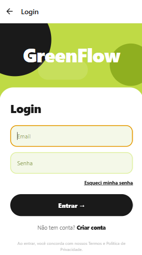
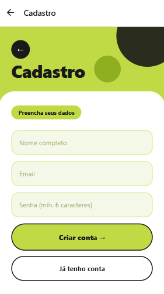
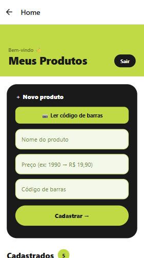
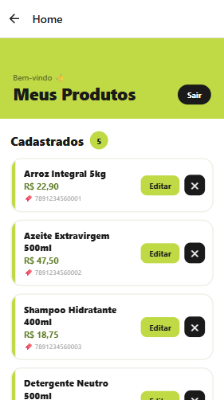

# 🍀 GreenFlow | CP2

### Nicoli Amy Kassa | RM 559104

## Aula: Login + Navegação

Este projeto foi desenvolvido em aula com o objetivo de ensinar os conceitos fundamentais de **React Native com Expo**, focando em:

- Criação de projeto
- Organização de pastas
- Construção de telas
- Navegação entre telas
- Componentização básica

# 🎯 Objetivo

Construir uma aplicação simples contendo:

- Tela de Login
- Tela de Cadastro
- Tela de Recuperação de Senha
- Tela Home
- Navegação entre telas (Stack)

> ⚠️ Este projeto NÃO possui backend.
> O foco é **layout + navegação**.
 

# 🧱 Tecnologias utilizadas

- React Native
- Expo (SDK 54)
- React Navigation

# 🚀 Como executar o projeto

## 1. Clonar o repositório

```bash
https://github.com/Nicoli-Kassa/MOBILE_CP2.git
```

## 2. Instalar dependências

```bash
npm install
```

## 3. Rodar o projeto

```bash
npx expo start
```


# 📁 Estrutura do projeto

```text
src/
  components/
  navigation/
    AppNavigator.js
  screens/
    LoginScreen.js
    RegisterScreen.js
    ForgotPasswordScreen.js
    HomeScreen.js
```
 

# 🧭 Fluxo de navegação

- Login → Home
- Login → Cadastro
- Login → Esqueci minha senha
- Cadastro → Voltar
- Esqueci senha → Voltar
- Home → Login
 

# 🧠 Conceitos abordados

- `View`, `Text`, `TextInput`, `Button`
- `TouchableOpacity`
- `StyleSheet`
- Navegação com Stack
- Props e navegação (`navigation.navigate`)
- Organização de projeto
- Componentização básica
 
# 📸 Telas do app

### Login



### Cadastro



### Recuperação de senha


### Home



